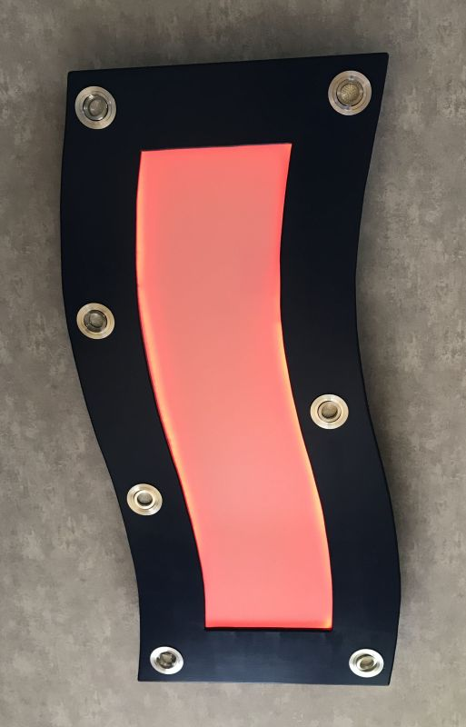

# CeilingLight
Ceiling Light with Webserver, controlling 12V LED Sports, RGB Sting as well as WS2812B String
## Hardware
* NodeMCU 0.9
* (Power) n-MOS FET
* Strip RGB Light (common anode)
* Strip WS2812B
* couple of LED beams

## Software
written in Arduino 1.8.12 with latesst ESP8266 extension
Webserver, JavaScrip and CSS created in [Glitch](http://www.glitch.com)
Webocket-Usage allos immediate reponse

Credit for Colourpicker and Strip Effect goes to [wireraken](https://github.com/wirekraken/ESP8266-Websockets-LED)

## Pictures

